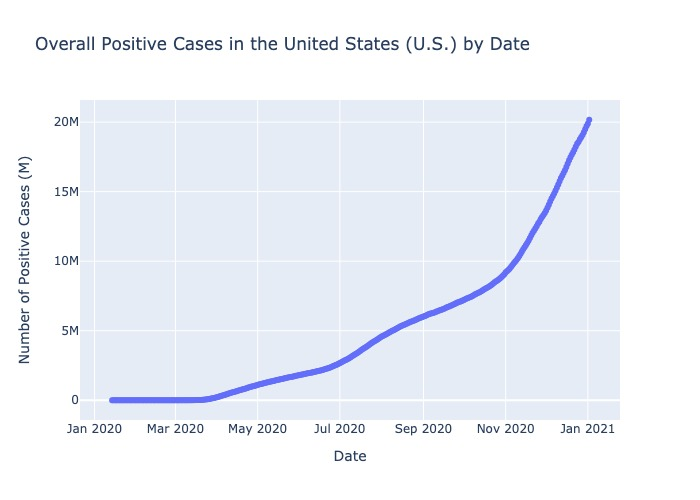
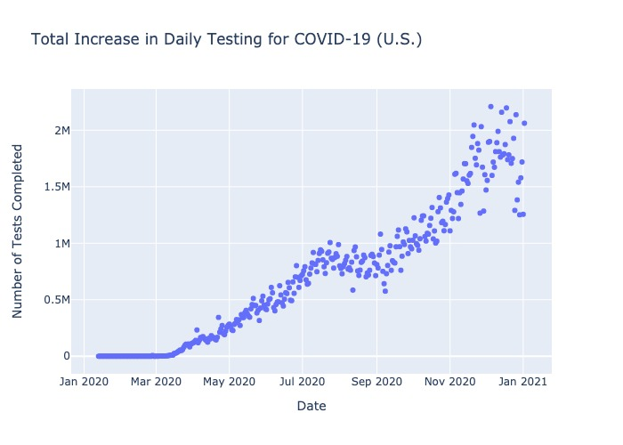
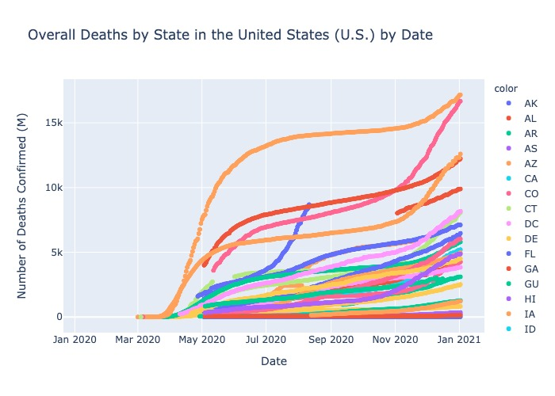
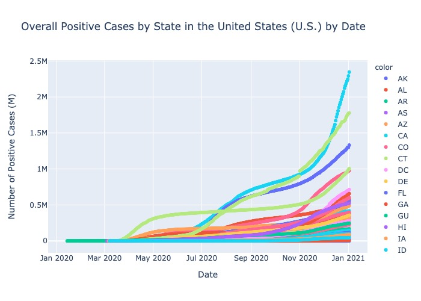

# COIVD-19 Dashboard & Exploratory Data Analysis

## About

This repository holds the documentation and EDA for the COVID-19 dashboard that can be found on Tableau Public. The EDA was done using Plotly inside of a Jupyter Notebook.

## Exploratory Data Analysis Details

**Last Updated: 12/15/2020**

The data source that was analyzed contains data ranging from 01/22/2020 through the current date. The source data is obtained through an external API, provided by the COVID Tracking Project, found [here](https://covidtracking.com/data/api). This analysis is stated as of the 'last updated' date, and will be updated and republished as the evolving situation changes. 

Figure 1: 

Figure 1 shows a consistent upward trend, with a minor drop in the positivity rate in the summer months of 2020, before a much more drastic increase in cases starting in October-November 2020. One common misnomer is that this increase is strictly due to an increase in testing, which can be seen in Figure 5. 

Figure 5: 

The position of case counts being directly in tandem with an increase in testing is diminished when looking at the deaths that COVID-19 has caused. If case count were tied to case count explicitly, there would be a little correlation in terms of deaths. However, when looking at deaths casued by COVID-19 (Figure 3), it can be observed that, while the death count is occuring at a much lower overall rate, it has maintained relatively on par with the increase in case count. 

Figure 3: 

Other Data Reviewed: 

Figure 2: 

Figure 4: 

